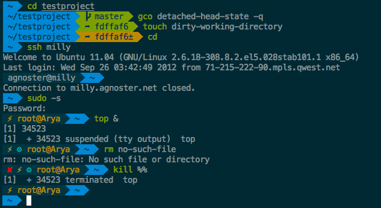
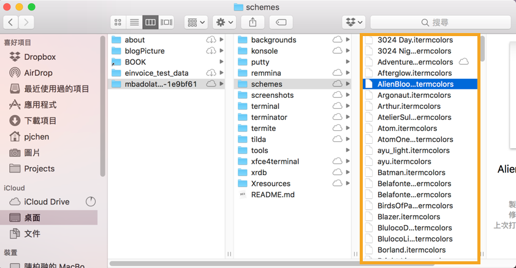
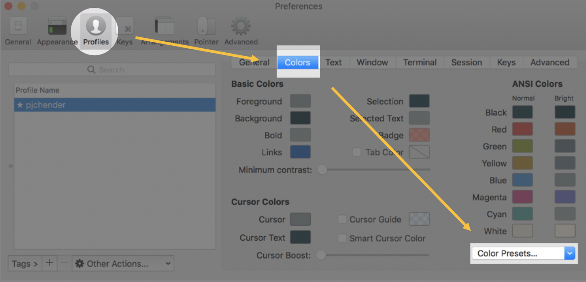
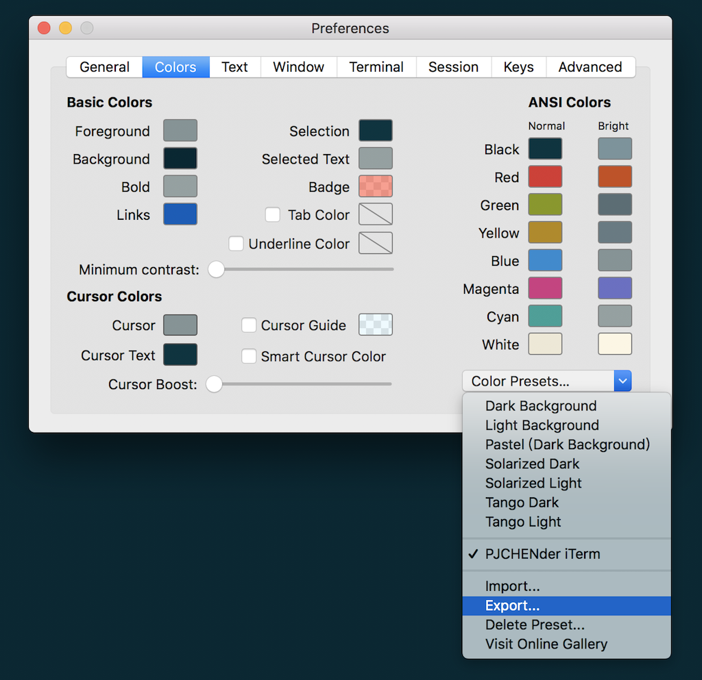
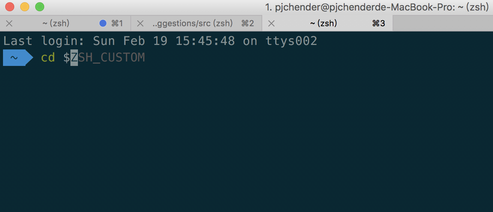

# 讓 MAC 終端機變好看

讓我們一起把 MAC 終端機變好看吧！！



## 安裝 Homebrew

> [Homebrew](http://brew.sh/index_zh-tw.html) 是 Mac OSX 上的的套件管理工具，是方便安裝管理 OSX 裡需要要用到但預設沒安裝的套件。
打開終端機，輸入：

```bash
/usr/bin/ruby -e "$(curl -fsSL https://raw.githubusercontent.com/Homebrew/install/master/install)"
```

輸入以下可以確認是否安裝成功：

```bash
brew --version
```

目前應該是 2.2.0 (2019-11-30)

## 安裝 iTerm2

### iTerm2 下載

[iTerm2](https://www.iterm2.com/features.html) 是一個可以用來取代 MAC 原生終端機的工具，擁有許多[更方便的功能和特色](https://www.iterm2.com/features.html)，只需到[官網下載](https://www.iterm2.com/downloads.html)安裝就可以了。

或者也可以在 terminal 中輸入下述的指令，直接透過 homebrew 安裝：

```bash
brew cask install iterm2
```

## iTerm2配色安裝與下載

iTerm2 提供非常多的配色主題可以下載，可以到 [iterm2 color schemes](http://iterm2colorschemes.com/) 的網站選擇喜歡的配色，右上角有下載的標示可以整包下載下來，下面則會顯示各種配色。

解壓縮後在 schemes 中有許多副檔名為 .itermcolors 的配色檔可以載入，這裡我們選擇 [Solarized Dark Theme Patched Version（下載）](https://raw.githubusercontent.com/mbadolato/iTerm2-Color-Schemes/master/schemes/Solarized%20Dark%20-%20Patched.itermcolors)：



### 推薦

- [Solarized Dark theme](https://raw.githubusercontent.com/mbadolato/iTerm2-Color-Schemes/master/schemes/Solarized%20Dark%20-%20Patched.itermcolors)
- [Solarized Light theme](https://raw.githubusercontent.com/altercation/solarized/master/iterm2-colors-solarized/Solarized%20Light.itermcolors)
- [More themes @ iterm2colorschemes](http://iterm2colorschemes.com/)

## 套用 iTerm 的配色

`選好喜歡的配色後，打開 iTerm2 後按快捷鍵` cmd + i` ，選擇上方名為 color 的頁籤，在右下方的 Color Presets 中透過 import 匯入配色後再點選一次 Color Preset 就可以選取：

打開 iTerm，進入以下路徑 iterm—>preference —> profiles —> colors —> load
改成 Solarzied Dark Theme





## 安裝 ZSH

### ZSH 下載與安裝

[ZSH](http://www.zsh.org/) 是用來取代 BASH 的一種工具，打開 Terminal 輸入：

```bash
brew install zsh zsh-completions
```

透過以下程式碼可以確認是否安裝成功：

```bash
zsh --version
```

目前應該是 5.4.2 @ 2018.05.03

## 將預設的窗口改為ZSH

將 Shell 預設窗口 從 BASH 改成 ZSH，在終端機輸入：

```bash
sudo sh -c "echo $(which zsh) >> /etc/shells"
chsh -s $(which zsh)
```

接著在終端機輸入

```bash
echo $SHELL
```

如果成功更改的話，應該會出現

```bash
/bin/zsh
```

## 安裝 Oh My ZSH

### Oh My ZSH 下載與安裝

[Oh My Zsh](http://ohmyz.sh/) 是一個用來管理 ZSH 設定檔（configuration）的框架，提供了很多的外掛（plugin）和主題（theme）可以選擇。

要安裝 Oh My Zsh 只需在終端機輸入

```bash
sh -c "$(curl -fsSL https://raw.github.com/robbyrussell/oh-my-zsh/master/tools/install.sh)"
```

### 使用 Oh My Zsh

接下來我們要套用主題，一樣在終端機輸入：

```bash
open ~/.zshrc
```

接著會打開 zsh 的設定檔，找到 *ZSH_THEME=”…”*，將這段的內容改成

```bash
ZSH_THEME="agnoster"
```

之後 `cmd + s` 存檔

### 套用字體

在安裝的過程中，如果你發現出現一些看不懂的文字或亂碼時，很可能是因為沒有相對應的字體，因此我們要下載字體。

下載字體檔：[Meslo](https://github.com/powerline/fonts/blob/master/Meslo%20Dotted/Meslo%20LG%20L%20DZ%20Regular%20for%20Powerline.ttf?raw=true)（截圖中所使用的）或者也可以到 [Powerline fonts](https://github.com/powerline/fonts) @ github 中找到其他你要的字體後，在 「view raw」上點右鍵選擇「另存連結」將字體檔下載後並安裝。

在 iTerm2 中套用字體（Meslo）：iTerm --> Preferences --> Profiles --> Text --> Change Font

## 其他外掛或建議

### Auto suggestions (for Oh My Zsh)

在終端機輸入：

```bash
git clone git://github.com/zsh-users/zsh-autosuggestions $ZSH_CUSTOM/plugins/zsh-autosuggestions
```

打開 ZSH 設定檔：

```bash
open ~/.zshrc
```

找到 plugins = “” 的地方，在 plugins 的欄位中加入 *zsh-autosuggestion* 後存檔：

```bash
plugins=(zsh-autosuggestions)
```

有時候你的背景色和提示的文字會太過接近，以致於你看不到 *autosuggestions* 的文字，這時候需要去設定顯示的文字。一樣先在終端機輸入以下文字，以開啟設定檔：

```bash
open $ZSH_CUSTOM/plugins/zsh-autosuggestions/zsh-autosuggestions.zsh
```

打開設定檔後，在文件中找到這行 `ZSH_AUTOSUGGEST_HIGHLIGHT_STYLE='fg=8'`（預設會是 fg=8），這就是給終端機所使用的[256色碼](http://www.calmar.ws/vim/256-xterm-24bit-rgb-color-chart.html)，你可以改成自己喜歡的顏色，這裡我用 fg=240 感覺比較合適。

```bash
ZSH_AUTOSUGGEST_HIGHLIGHT_STYLE='fg=240'
```

接著，只要你輸入過相關的文字，下次再次打入同樣的文字的時候，就會產生自動建議的文字，按下→後就會自動帶入，像是這樣的效果：



### 客制化 Prompt

在終端機中預設的 prompt 會是 *user@hostname*，非常長一串，我們可以透過以下的方式讓那一長串不要顯示出來。

打開 ZSH 設定檔：

```bash
open ~/.zshrc
```

找個地方加入下面這段，*DEFAULT_USER* 中 *yourname* 要填的是你使用者的名稱，如果不知道使用者的名稱的話，可以在終端機輸入 whoami：

```bash
# optionally set DEFAULT_USER in ~/.zshrc to your regular username to hide the “user@hostname” info when you’re logged in as yourself on your local machine.
DEFAULT_USER=yourname
```

### 程式碼高亮（Syntax Highlighting）

在終端機輸入下面這段，下載 Syntax Highlighting：

```bash
brew install zsh-syntax-highlighting
```

接著一樣打開 ZSH 設定檔：

```bash
open ~/.zshrc
```

在設定檔的最下面加上這段

```bash
source /usr/local/share/zsh-syntax-highlighting/zsh-syntax-highlighting.zsh
```

## 參考資料

### 主要參考資料

[iterms2 solarized](https://gist.github.com/kevin-smets/8568070)

### 其他相關連結

- [zsh 官方網站](http://www.zsh.org/)
- [Oh My Zsh 官方網站](http://ohmyz.sh/)
- [installing ZSH](https://github.com/robbyrussell/oh-my-zsh/wiki/Installing-ZSH)
- [installing curl in Mac OSX](http://macappstore.org/curl/)

## 其他建議或補充

### 快捷鍵

| `cmd + d`| 可以分割視窗 |
| -- | -- |
| `cmd + shift + d` | 垂直分割 |

若是之前的設定檔載入不了 可以在 *.zhsrc* 下 *source /Users/XXX/.bash_profile*
